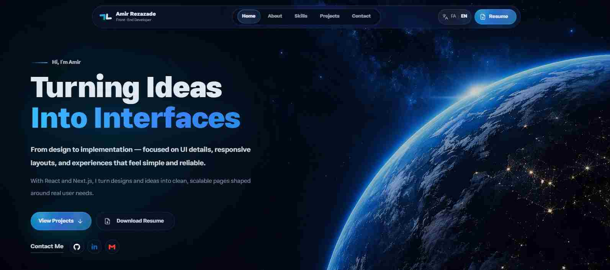

<div dir="rtl">

# پورتفولیو امیر رضازاده

وب‌سایت شخصی ساخته‌شده با Next.js App Router. کاملاً دوزبانه (فارسی / انگلیسی) با تغییر جهت صفحه، پس‌زمینهٔ فضایی ثابت و یک صفحهٔ لودینگ کوتاه دوپرده‌ای.

[مشاهده سایت](https://amir-rezazade.vercel.app/)

## Preview



## تکنولوژی‌ها

| بخش        | انتخاب                                                |
| ---------- | ----------------------------------------------------- |
| فریم‌ورک   | Next.js با App Router                                 |
| استایل     | Tailwind CSS v4 به‌همراه متغیرهای CSS                 |
| اسکرول نرم | Lenis                                                 |
| آیکن‌ها    | react-icons، lucide-react و SVG اختصاصی               |
| فونت‌ها    | پیدا (تیتر فارسی)، استعداد (متن فارسی)، Inter (لاتین) |

## قابلیت‌ها

- **دوزبانه** — تمام متن‌ها در `src/data/*.js` بر اساس زبان نگهداری می‌شوند. زبان انتخابی در کوکی ذخیره می‌شود، پس سرور از همان اولین رندر `lang` و `dir` درست را می‌فرستد و هیچ پرش جهتی دیده نمی‌شود.
- **صفحهٔ لودینگ** — دو پرده که با یک تایم‌لاین واحد کنار می‌روند: نشان جا می‌افتد، نوار مویی پر می‌شود، بعد پرده‌ها باز می‌شوند. تا آماده شدن صفحه، اسکرول قفل است.
- **فرم تماس کارا** — ارسال AJAX با حالت‌های در حال ارسال، موفقیت و خطا.
- **دسترس‌پذیر** — ساختار معنایی، حالت فوکوس مشخص، پشتیبانی از `prefers-reduced-motion` و اسکرول‌بار پنهان ولی فعال.

## ساختار پروژه

<div dir="ltr">

```txt
src/
├── app/
│   ├── layout.jsx              لایوت ریشه، خواندن کوکی زبان
│   ├── page.jsx                ارسال زبان اولیه به اپ
│   ├── globals.css             متغیرهای تم و کلاس‌های مشترک
│   ├── logo-loader.css         نشان برند و صفحهٔ لودینگ
│   ├── icon.svg                فاویکون برداری
│   └── api/github-contributions/
├── components/                 Navbar, Hero, About, Skills, Projects, Contact, Footer …
├── data/                       محتوای دوزبانهٔ هر بخش
└── lib/                        هلپرهای زبان و کلاس‌نیم

public/
├── media/                      ویدیوی پس‌زمینه (mp4 و webm) و پوسترها
├── fonts/                      پیدا و استعداد به‌صورت لوکال
└── projects/                   اسکرین‌شات پروژه‌ها
```

</div>

## اجرا

<div dir="ltr">

```bash
npm install
npm run dev     # http://localhost:3000
npm run build
npm start
```

</div>
